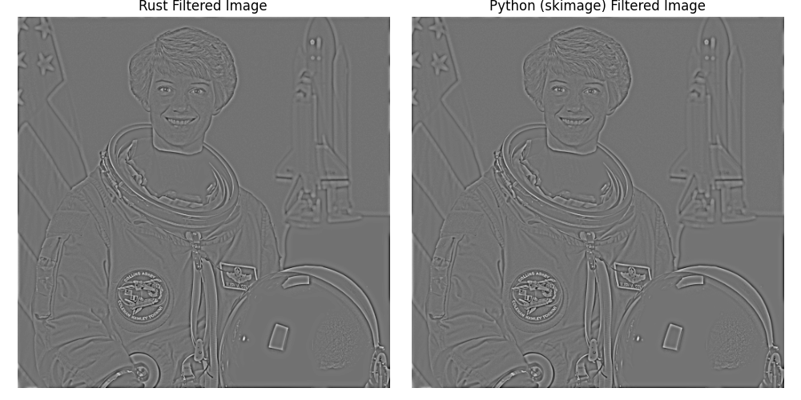
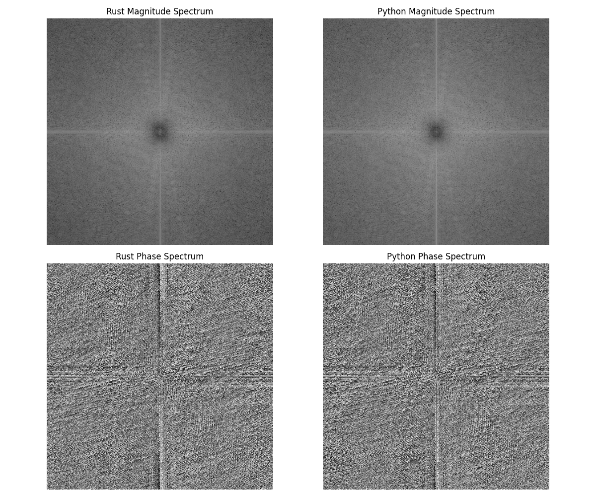

[](https://github.com/altunenes/butter2d/actions/workflows/rust.yml) 
[](https://crates.io/crates/butter2d)
[](https://docs.rs/butter2d)
[](https://zenodo.org/doi/10.5281/zenodo.11004855)
[](https://github.com/altunenes/butter2d/actions/workflows/release.yml)
# butter2d


Pure Rust Implementation of the Butterworth Filter

This crate provides a pure Rust implementation of the Butterworth filter, designed for high-performance spatial frequency filtering of images. It is inspired by and seeks to replicate the functionality of the Butterworth filter as implemented in the popular Python library, [scikit-image](https://github.com/scikit-image/scikit-image/blob/2ac3e141e8d2e31aa0ec10afc3a935396b0618fc/skimage/filters/_fft_based.py#L58-L185).

## Overview

The Butterworth filter offers a more robust method for applying spatial frequency filters to images compared to traditional FFT/IFFT-based methods. Filters with sharp cutoffs can often lead to the Gibbs phenomenon, where undesirable ringing artifacts appear near edges in the image. This issue is particularly problematic in applications such as EEG experiments (particularly low/mid visual ones that affect P100 amplitudes in the visual cortex) and other scenarios involving low-frequency signals. By providing a smoother transition between the passband and stopband, the Butterworth filter mitigates these effects, making it a preferred choice among vision scientists and image-processing experts.

## Features

- Pure Rust implementation for optimal performance and integration with Rust-based image processing pipelines.
- Support for both high-pass and low-pass filtering, with customizable cutoff frequency and filter order parameters.
- Detailed examples and documentation to help users quickly integrate the filter into their projects.

## Comparisons: Rust vs Python with Same Input Values

To visually demonstrate the effectiveness and similarity of our Rust implementation compared to the Python (scikit-image) version, here are comparison images. These comparisons help illustrate both the visual and frequency spectrum outcomes using identical input values across both implementations.

### Visual Comparison



### Spectrum Comparison



### Usage

Here's a quick example of applying a high-pass Butterworth filter to an image:
```rust
cargo add butter2d
```

```rust
use image::{GrayImage, open};
use butter2d::butterworth;

fn main() {
    let img = open("path/to/your/image.png").expect("Failed to open image").to_luma8();
    let cutoff_frequency_ratio = 0.1;
    let high_pass = true;
    let order = 2.0;
    let squared_butterworth = false;
    let npad = 0;
    let filtered_img = butterworth(
        &img, 
        cutoff_frequency_ratio, 
        high_pass, 
        order, 
        squared_butterworth, 
        npad
    );
    filtered_img.save("path/to/save/filtered_image.png").expect("Failed to save filtered image");
}
```

## Download the Demo

For a hands-on experience, download the latest demo from  [Releases page](https://github.com/altunenes/butter2d/releases/). The demo, available for Windows, Mac, and Ubuntu, features interactive controls and dynamic image processing capabilities. As you adjust sliders, changes are applied in real-time, allowing for immediate visual feedback. This setup is specifically designed to facilitate the creation of Fourier phase scrambled versions of images dynamically. For instance, if you apply a high-pass filter and then a low-pass filter, the final output will be the low-pass version of the previously high-pass filtered image. For a more precise implementation, set your parameters first and then upload the image.


### Download the Tauri App

You can try my Tauri app for clearer and more precise applications. You can find the source code [here](https://github.com/altunenes/gevende)

App:


## Windows

- For most Windows users, download the installer:
  - [gevende_0.0.0_x64-setup.exe](https://github.com/altunenes/gevende/releases/download/app-v1.0.0/gevende_0.0.0_x64-setup.exe)
- If you prefer a Microsoft Installer package, download:
  - [gevende_0.0.0_x64_en-US.msi](https://github.com/altunenes/gevende/releases/download/app-v1.0.0/gevende_0.0.0_x64_en-US.msi)

## macOS

- For macOS users, download the DMG file:
  - [gevende_0.0.0_x64.dmg](https://github.com/altunenes/gevende/releases/download/app-v1.0.0/gevende_0.0.0_x64.dmg)
- For Apple Silicon (M1, M2 chips), download the ARM DMG:
  - [gevende_0.0.0_aarch64.dmg](https://github.com/altunenes/gevende/releases/download/app-v1.0.0/gevende_0.0.0_aarch64.dmg)

## Linux

- For Debian-based distributions:
  - [gevende_0.0.0_amd64.deb](https://github.com/altunenes/gevende/releases/download/app-v1.0.0/gevende_0.0.0_amd64.deb)
- AppImage:
  - [gevende_0.0.0_amd64.AppImage](https://github.com/altunenes/gevende/releases/download/app-v1.0.0/gevende_0.0.0_amd64.AppImage)

## Tarballs

- tarballs:
  - macOS Intel x64: [gevende_x64.app.tar.gz](https://github.com/altunenes/gevende/releases/download/app-v1.0.0/gevende_x64.app.tar.gz)
  - macOS Apple Silicon: [gevende_aarch64.app.tar.gz](https://github.com/altunenes/gevende/releases/download/app-v1.0.0/gevende_aarch64.app.tar.gz)
